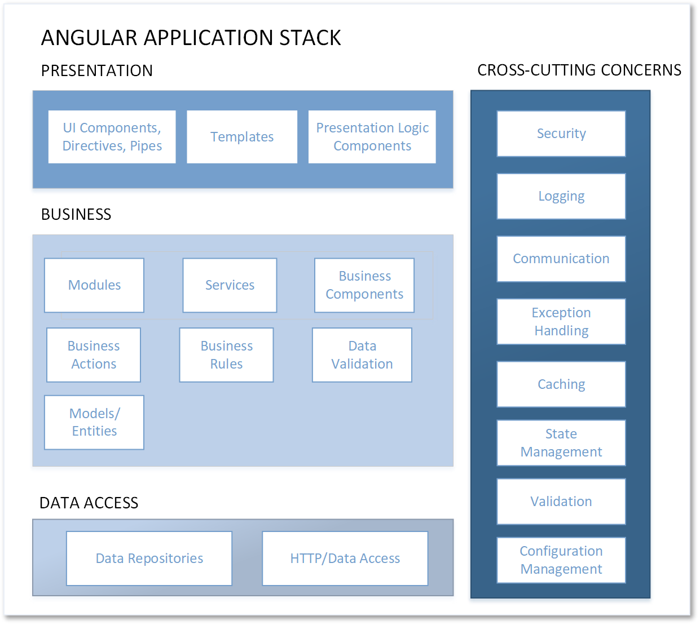
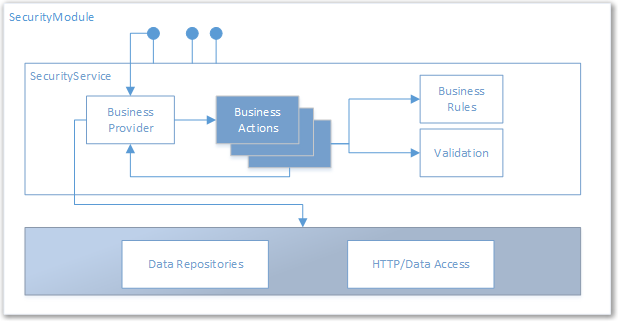

# Custom Angular Security Module :: A Guide on Creating, Publishing, and Using the buildmotion-security Module
An Angular security module to implement OAuth authentication, subscriber, subscriber confirmation, account creation and confirmation, password reset, etc.

## Setup
The following section outlines the tools that will be used to develop our custom angular modules. It has been awhile since I've updated to newer version of Angular and Typescript - so I wanted to upgrade my personal development environment for this little project. This guide is using version 5 of Angular modules and version 2.4 of Typescript. It is not a requirement to use these versions for developing custom Angular modules. Your considerations are that the versions are compatible with each other and what versions you want to target for consumers of your module. 

Not everyone is going to be using the latest versions of Angular and Typescript. If you are developing custom modules to share within your ` private ` development environment (work, school), you may not want to make your modules public and available on repositories like [npm](.https://www.npmjs.com). Therefore, the versions that you are using is not a major concern. However, if you are developing modules that you want to share with the world, because you are awesome, you will have to have at least some consideration for users of your custom module libraries.   

### Visual Studio Code
Visual Studio Code is a lightweight but powerful source code editor which runs on your desktop and is available for Windows, macOS and Linux. It comes with built-in support for JavaScript, TypeScript and Node.js and has a rich ecosystem of extensions for other languages (such as C++, C#, Java, Python, PHP, Go) and runtimes (such as .NET and Unity). Begin your journey with VS Code with these introductory videos.

* [https://code.visualstudio.com/download](https://code.visualstudio.com/download)

Visual Studio Code also has many extensions that can be downloaded to customize your development environment and experience. 

* [Debugger for Chrome](https://marketplace.visualstudio.com/items?itemName=msjsdiag.debugger-for-chrome)
* [TSLint](https://marketplace.visualstudio.com/items?itemName=eg2.tslint)

### Node.js and NPM
Download and install node.js. We will use ` npm ` to install packages/libraries from the npm public repository. 

* [https://nodejs.org/en/download/](https://nodejs.org/en/download/)

## Angular-CLI install
We will use the Angular CLI tool to generate module items. The CLI tool will create/scaffold modules, services, classes, components and more. It also can be used to compile our application. It can be used to setup new web projects (full and lightweight). 

```javascript
npm install -g @angular/cli@latest
```

## Typescript Install
We will use the latest compatible version of Typescript. 

```javascript
npm install -g typescript@2.5.0
```

## Setup
Now that we have the basic tools installed we are ready to create a new custom angular module. We will need a new folder to build out the new custom module.

Create a ` buildmotion-security ` folder on your computer. 

```javascript
mkdir buildmotion-security
```

Since we will take advantage of the ` angular-cli ` tool we need to add (2) folders to support the tooling and folder conventions of the CLI.

Create the following folder structure in the root of the project. 

```javascript
src\app
```


### package.json
Use the the npm command to create a new package.json file for the new project. This file will be used to define our module dependencies. 

```javascript
npm init
```

Learn more at:
* [https://docs.npmjs.com/cli/init](https://docs.npmjs.com/cli/init)
* [https://docs.npmjs.com/files/package.json](https://docs.npmjs.com/files/package.json)
* [https://docs.npmjs.com/misc/config](https://docs.npmjs.com/misc/config)

The default contents of the ` package.json ` file is:

```javascript
{
  "name": "buildmotion-security",
  "version": "1.0.0",
  "description": "An Angular module to support OAuth authentication, login, subscriber, confirmations and resets.",
  "main": "index.js",
  "scripts": {
    "test": "echo \"Error: no test specified\" && exit 1",
    "transpile": "ngc",
    "build": "npm run transpile"
  },
  "repository": {
    "type": "git",
    "url": "git+https://github.com/buildmotion/buildmotion-security.git"
  },
  "keywords": [
    "Angular",
    "security",
    "Build",
    "Motion",
    "Matt",
    "Vaughn",
    "Angularlicious",
    "buildmotion",
    "#Angularlicious",
    "OAuth",
    "login"
  ],
  "author": "Matt Vaughn",
  "license": "MIT",
  "bugs": {
    "url": "https://github.com/buildmotion/buildmotion-security/issues"
  },
  "homepage": "https://github.com/buildmotion/buildmotion-security#readme",
}
```

Update the ` scripts ` section to include the following.

```javascript
"transpile": "ngc",
"build": "npm run transpile"
```

The current ` package.json ` file does not have any ` devDependencies ` or ` Dependencies `. We will need to either update the file or use the ` npm ` command to add the packages to our module project. 

Run the following in the terminal to add the ` devDependencies ` to the project. Note: you might have to be running Visual Studio Code in Administrator.

```javascript
npm install --save-dev rxjs@5.5.6
npm install --save-dev @angular/cli@latest
npm install --save-dev @angular/common@latest
npm install --save-dev @angular/compiler@latest
npm install --save-dev @angular/core@latest
npm install --save-dev @angular/forms@latest
npm install --save-dev @angular/http@latest
npm install --save-dev @angular/router@latest
npm install --save-dev @angular/compiler-cli@latest
npm install --save-dev typescript@<2.5.0
```

The npm install ' --save-dev ` will update the ` devDependencies ` section in the ` package.json ` file. 

```javascript
  "devDependencies": {
    "@angular/cli": "^1.6.8",
    "@angular/common": "^5.2.4",
    "@angular/compiler": "^5.2.4",
    "@angular/compiler-cli": "^5.2.4",
    "@angular/core": "^5.2.4",
    "typescript": "^2.5.0"
  }
```
Use the ` ng -v ` command to view the package information with versions.
```text
    _                      _                 ____ _     ___
   / \   _ __   __ _ _   _| | __ _ _ __     / ___| |   |_ _|
  / △ \ | '_ \ / _` | | | | |/ _` | '__|   | |   | |    | |
 / ___ \| | | | (_| | |_| | | (_| | |      | |___| |___ | |
/_/   \_\_| |_|\__, |\__,_|_|\__,_|_|       \____|_____|___|
               |___/

Angular CLI: 1.6.8
Node: 8.9.1
OS: win32 x64
Angular: 5.2.4
... common, compiler, compiler-cli, core

@angular/cli: 1.6.8
@angular-devkit/build-optimizer: 0.0.42
@angular-devkit/core: 0.0.29
@angular-devkit/schematics: 0.0.52
@ngtools/json-schema: 1.1.0
@ngtools/webpack: 1.9.8
@schematics/angular: 0.1.17
typescript: 2.5.0
webpack: 3.10.0
```

### tsconfig.json
Use the Typescript command to create a ` tsconfig.json ` file for the application. The configuration information in this file will be used to compile the Typescript. 

```javascript
tsc --init
```

The default output of the ` tsc --init ` is below. WE can customize the configuration. I like that there are comments that describe the usage of the different options. 

```javascript
{
  "compilerOptions": {
    /* Basic Options */
    "target": "es5",                          /* Specify ECMAScript target version: 'ES3' (default), 'ES5', 'ES2015', 'ES2016', 'ES2017', or 'ESNEXT'. */
    "module": "commonjs",                     /* Specify module code generation: 'commonjs', 'amd', 'system', 'umd', 'es2015', or 'ESNext'. */
    // "lib": [],                             /* Specify library files to be included in the compilation:  */
    // "allowJs": true,                       /* Allow javascript files to be compiled. */
    // "checkJs": true,                       /* Report errors in .js files. */
    // "jsx": "preserve",                     /* Specify JSX code generation: 'preserve', 'react-native', or 'react'. */
    // "declaration": true,                   /* Generates corresponding '.d.ts' file. */
    // "sourceMap": true,                     /* Generates corresponding '.map' file. */
    // "outFile": "./",                       /* Concatenate and emit output to single file. */
    // "outDir": "./",                        /* Redirect output structure to the directory. */
    // "rootDir": "./",                       /* Specify the root directory of input files. Use to control the output directory structure with --outDir. */
    // "removeComments": true,                /* Do not emit comments to output. */
    // "noEmit": true,                        /* Do not emit outputs. */
    // "importHelpers": true,                 /* Import emit helpers from 'tslib'. */
    // "downlevelIteration": true,            /* Provide full support for iterables in 'for-of', spread, and destructuring when targeting 'ES5' or 'ES3'. */
    // "isolatedModules": true,               /* Transpile each file as a separate module (similar to 'ts.transpileModule'). */

    /* Strict Type-Checking Options */
    "strict": true                            /* Enable all strict type-checking options. */
    // "noImplicitAny": true,                 /* Raise error on expressions and declarations with an implied 'any' type. */
    // "strictNullChecks": true,              /* Enable strict null checks. */
    // "noImplicitThis": true,                /* Raise error on 'this' expressions with an implied 'any' type. */
    // "alwaysStrict": true,                  /* Parse in strict mode and emit "use strict" for each source file. */

    /* Additional Checks */
    // "noUnusedLocals": true,                /* Report errors on unused locals. */
    // "noUnusedParameters": true,            /* Report errors on unused parameters. */
    // "noImplicitReturns": true,             /* Report error when not all code paths in function return a value. */
    // "noFallthroughCasesInSwitch": true,    /* Report errors for fallthrough cases in switch statement. */

    /* Module Resolution Options */
    // "moduleResolution": "node",            /* Specify module resolution strategy: 'node' (Node.js) or 'classic' (TypeScript pre-1.6). */
    // "baseUrl": "./",                       /* Base directory to resolve non-absolute module names. */
    // "paths": {},                           /* A series of entries which re-map imports to lookup locations relative to the 'baseUrl'. */
    // "rootDirs": [],                        /* List of root folders whose combined content represents the structure of the project at runtime. */
    // "typeRoots": [],                       /* List of folders to include type definitions from. */
    // "types": [],                           /* Type declaration files to be included in compilation. */
    // "allowSyntheticDefaultImports": true,  /* Allow default imports from modules with no default export. This does not affect code emit, just typechecking. */

    /* Source Map Options */
    // "sourceRoot": "./",                    /* Specify the location where debugger should locate TypeScript files instead of source locations. */
    // "mapRoot": "./",                       /* Specify the location where debugger should locate map files instead of generated locations. */
    // "inlineSourceMap": true,               /* Emit a single file with source maps instead of having a separate file. */
    // "inlineSources": true,                 /* Emit the source alongside the sourcemaps within a single file; requires '--inlineSourceMap' or '--sourceMap' to be set. */

    /* Experimental Options */
    // "experimentalDecorators": true,        /* Enables experimental support for ES7 decorators. */
    // "emitDecoratorMetadata": true,         /* Enables experimental support for emitting type metadata for decorators. */
  }
}
```

We will now modify the ` tsconfig.json ` file. Note that the ` rootDir ` item is set to ` src/app ` - this is to support using the ` angular-cli ` tool. The ` paths ` option is to allow the compiler to access the ` dependencies ` of the module.

More information about compiler options: [https://www.typescriptlang.org/docs/handbook/compiler-options.html](https://www.typescriptlang.org/docs/handbook/compiler-options.html)

```json
{
  "compilerOptions": {
    /* Basic Options */
    "target": "es5", /* Specify ECMAScript target version: 'ES3' (default), 'ES5', 'ES2015', 'ES2016', 'ES2017', or 'ESNEXT'. */
    "module": "es2015", /* Specify module code generation: 'commonjs', 'amd', 'system', 'umd', 'es2015', or 'ESNext'. */
    "lib": [
      "es2015",
      "dom"
    ],
    /* Specify library files to be included in the compilation:  */
    "declaration": true, /* Generates corresponding '.d.ts' file. */
    "sourceMap": true, /* Generates corresponding '.map' file. */
    "outDir": "dist", /* Redirect output structure to the directory. */
    "rootDir": "src/app", /* Specify the root directory of input files. Use to control the output directory structure with --outDir. */
    "skipLibCheck": true,
    /* Strict Type-Checking Options */
    "strict": true, /* Enable all strict type-checking options. */
    "noImplicitAny": true, /* Raise error on expressions and declarations with an implied 'any' type. */
    "strictNullChecks": true, /* Enable strict null checks. */
    "stripInternal": true,
    /* Module Resolution Options */
    "moduleResolution": "node", /* Specify module resolution strategy: 'node' (Node.js) or 'classic' (TypeScript pre-1.6). */
    "baseUrl": "./", /* Base directory to resolve non-absolute module names. */
    "paths": {
      "@angular/core": [
        "node_modules/@angular/core/*"
      ]
    },
    /* Source Map Options */
    "inlineSources": true, /* Emit the source alongside the sourcemaps within a single file; requires '--inlineSourceMap' or '--sourceMap' to be set. */
    /* Experimental Options */
    "experimentalDecorators": true /* Enables experimental support for ES7 decorators. */
  }
}
```
Add the following new sections to the the ` tsconfig.json ` file. These items are not part of the ` compilerOptions ` section.

* files
* angularCompilerOptions

```json
"files": [],
"angularCompilerOptions": {}
```
The following items were added to the ` angularCompilerOptions ` section. 

* "annotateForClosureCompiler": true,
* "strictMetadataEmit": true,
* "skipTemplateCodegen": true,
* "flatModuleOutFile": "buildmotion-security.js",
* "flatModuleId": "buildmotion-security"

The following item was added to the  ` files ` section.

* "./src/app/index.ts"

The final configuration for ` tsconfig.json `

```json
{
  "compilerOptions": {
    /* Basic Options */
    "target": "es5", /* Specify ECMAScript target version: 'ES3' (default), 'ES5', 'ES2015', 'ES2016', 'ES2017', or 'ESNEXT'. */
    "module": "es2015", /* Specify module code generation: 'commonjs', 'amd', 'system', 'umd', 'es2015', or 'ESNext'. */
    "lib": [
      "es2015",
      "dom"
    ],
    /* Specify library files to be included in the compilation:  */
    "declaration": true, /* Generates corresponding '.d.ts' file. */
    "sourceMap": true, /* Generates corresponding '.map' file. */
    "outDir": "dist", /* Redirect output structure to the directory. */
    "rootDir": "src/app", /* Specify the root directory of input files. Use to control the output directory structure with --outDir. */
    "skipLibCheck": true,
    /* Strict Type-Checking Options */
    "strict": true, /* Enable all strict type-checking options. */
    "noImplicitAny": true, /* Raise error on expressions and declarations with an implied 'any' type. */
    "strictNullChecks": true, /* Enable strict null checks. */
    "stripInternal": true,
    /* Module Resolution Options */
    "moduleResolution": "node", /* Specify module resolution strategy: 'node' (Node.js) or 'classic' (TypeScript pre-1.6). */
    "baseUrl": "./", /* Base directory to resolve non-absolute module names. */
    "paths": {
      "@angular/core": [
        "node_modules/@angular/core/*"
      ]
    },
    /* Source Map Options */
    "inlineSources": true, /* Emit the source alongside the sourcemaps within a single file; requires '--inlineSourceMap' or '--sourceMap' to be set. */
    /* Experimental Options */
    "experimentalDecorators": true /* Enables experimental support for ES7 decorators. */
  },
  "files": [
    "./src/app/index.ts"
  ],
  "angularCompilerOptions": {
    "annotateForClosureCompiler": true,
    "strictMetadataEmit": true,
    "skipTemplateCodegen": true,
    "flatModuleOutFile": "buildmotion-security.js",
    "flatModuleId": "buildmotion-security"
  }
}
```

### angular-cli.json
Since we want to take advantage of the Angular CLI tool, we'll need to add a ` angular-cli.json ` configuration file to the root of the project. Use the following content as a template for the configuration.

```json
{
    "project": {
        "version": "1.0.0",
        "name": "buildmotion-security"
    },
    "apps": [
        {
            "tsconfig": "tsconfig.json",
            "mobile": false,
            "root": "src",
            "prefix": "app"
        }
    ],
    "defaults": {
        "styleExt": "css",
        "prefixInterfaces": false,
        "lazyRoutePrefix": "+"
    }
}
```

### index.ts
This file is really the most important element of the solution. It will allow you to publicly expose (can I say that in technical documentation?) or allow clients to find the specified module of the package - which is very important to Angular applications.

The only project member we need to expose is the module itself. The module will actually define what elements of the module are publicly visible - more on that later.

Add a new file ` index.ts ` in the ` app ` folder. This file will be used to reference the items in the module.

### SecurityModule
We are now ready to add the ` @NgModule ` to the project. We can use the CLI to do this. Use the following command to add an Angular module to the project. Since this project is a shared library/package for other Angular projects - we want to move the module file to the app folder.

```javascript
ng generate module security
```

By convention, the Angular CLI will create a folder for the module (thinking that it is working in a application project). 

* //TODO: Move the security.module.ts file to the ` app ` folder. And remove the ` security ` folder (since it is now empty).

```javascript
import { NgModule } from '@angular/core';
import { CommonModule } from '@angular/common';
import { FormsModule, ReactiveFormsModule } from '@angular/forms';
import { HttpModule } from '@angular/http';
import { RouterModule } from '@angular/router';

@NgModule({
  imports: [
    CommonModule,
    FormsModule,
    ReactiveFormsModule,
    HttpModule,
    RouterModule
  ],
  declarations: []
})
export class SecurityModule { }
```

Add an ` export ` statement to the ` index.ts ` file to reference the new module. 

```javascript
export * from './security.module';
```

We are now ready to build the module project.

```javascript
.\node_modules\.bin\ngc .\tsconfig.json
```

The ` dist ` folder will be created (as indicated in our ` outDir ` setting in the ` tsconfig.json `) - with the output of the ` ngc ` compile operation.

We could have used the ` npm run build ` command as well, because we already modified the ` package.json ` file with the ` transpile ` to use the ` ngc ` compiler located in the ` .bin ` folder in ` node_modules `. 

```json
 "scripts": {
    "transpile": "ngc",
    "build": "npm run transpile"
  }
```

Note: If you are getting compile errors using the ` npm run build ` - use 
the ` ngc ` command above and you will see more discreet error messages.

### Project Maintenance
We are now compiling and getting code into our output directory ` dist `. We are going to add a new step in our build process to clean the output directory before each build. This way we definitively know that the output of the build is the latest. We are going to add (2) tasks to the ` scripts ` section in the ` package.json ` file. The ` clean ` target will coordinate any folders that require maintenance.

* clean
* clean:dist

```
"clean": "npm run clean:dist",
"clean:dist": "@powershell -NoProfile -ExecutionPolicy Unrestricted -Command ./remove-dist-dir.ps1",
```

Create a new Powershell file `remove-dist-dir.ps1` with the following:

```
Remove-item -r .\dist\
```

The ` scripts ` section is starting to look more like a build process, right?
```json
"scripts": {
    "test": "echo \"Error: no test specified\" && exit 1",
    "transpile": "ngc",
    "build": "npm run clean && npm run transpile",
    "clean": "npm run clean:dist",
    "clean:dist": "@powershell -NoProfile -ExecutionPolicy Unrestricted -Command ./remove-dist-dir.ps1"
  }
```

Run the ` npm run build ` command. You should get similar output.

```text
> npm run clean && npm run transpile
> npm run clean:dist
> @powershell -NoProfile -ExecutionPolicy Unrestricted -Command ./remove-dist-dir.ps1
> ngc
```

We'll need to update the build process as we go. However, this is a good start for now.

## SecurityService
Use the Angular CLI to create a service for the module. 

```
ng generate service security
```

The CLI creates a service class with the ` @Injectable ` decorator. 

**security.service.ts**
```javascript
import { Injectable } from '@angular/core';

@Injectable()
export class SecurityService {

  constructor() { }

}

```

Since we have a new member of the module, we can add it to the ` index.ts ` file.

```javascript
export * from './security.service';
```

Run the build command to create the ` index.js ` file in the ` dist ` folder. 

```javascript
.\node_modules\.bin\ngc .\tsconfig.json
```

## Cross-Cutting Concerns
There are numerous cross-cutting concerns in most business applications. Imagine if you had to develop/implement this code on each project or application you work on. Some of do not have to image, we do this. But you should have

* logging
* error handling and logging
* security
* validation and rule processing
* alerts and notifications
* data persistence and retrieval
* analytics

### Logging Service
It is a good practice to have a logging concern in your application. Even if it is as simple as logging to the console - we can gain insight into what the application is doing in terms of processing, sequence, error messages, and debugging. Therefore, we are going to add a ` logging service to our module.

```javascript
npm install -S buildmotion-logging@latest
```
You will get a new entry in your package.json dependencies ` "buildmotion-logging": "^2.0.8" ` section. Update the ` SecurityModule ` to import the ` BuildMotionLoggingModule `. Notice that we are not going to provide the logging service in this module. It is a good practice to let the consumer of your modules to ` provide ` any services for the target application. 

```javascript
import { NgModule } from '@angular/core';
import { CommonModule } from '@angular/common';

import { BuildMotionLoggingModule } from 'buildmotion-logging';

@NgModule({
  imports: [
    BuildMotionLoggingModule,
    CommonModule
  ],
  declarations: []
})
export class SecurityModule { }
```

### Foundational Base Classes
The module that we are building is really an application that can be reused and shared by other Angular applications. This module will include:

* @Injectable services
* @Component components
* @Injectable HTTP services
* Business Logic implementation with business Actions

We could implement these features directly into the new module. However, I've built about 8 enterprise-level Angular applications during the last year. I can tell you from experience it is much easier to write once and use many. It is the reason why I am creating the ` Security ` module. All of the web applications that I am building for work, clients, and personal business require security features. 

I could copy the code from project to project - good luck with that technique. You will create technical debt over time and you will have to address the issue. Probably when you have the least amount of time to do so. I think the pay-as-you-go method works pretty good. Yes, we'll spend a little more time doing the one security module. However, we'll certainly get the return on this work on all future projects. Hopefully, you have a lot of them, right?

To get the foundational features, I'm going to leverage some of the ` modularity ` and ` shareability ` I've been talking about. We will install some npm packages from the ` buildmotion ` npm repository along with some dependency packages. See below.

```javascript
npm install -S @types/google.analytics@0.0.37
npm install -S typescript-dotnet-commonjs@4.8.0
npm install -S angular-rules-engine@2.2.0
npm install -S buildmotion-core
npm install -S buildmotion-foundation
```

We can start to use them with the ` SecurityService ` that is already part of the module. Before we do this, let's update the module and import the installed packages.

```javascript
import { NgModule } from '@angular/core';
import { CommonModule } from '@angular/common';
import { FormsModule, ReactiveFormsModule } from '@angular/forms';
import { HttpModule } from '@angular/http';
import { RouterModule } from '@angular/router';

import { BuildMotionLoggingModule } from 'buildmotion-logging';
import { BuildMotionCoreModule } from 'buildmotion-core';
import { BuildMotionFoundationModule } from 'buildmotion-foundation';

@NgModule({
  imports: [
    BuildMotionCoreModule,
    BuildMotionFoundationModule,
    BuildMotionLoggingModule,
    CommonModule,
    FormsModule,
    ReactiveFormsModule,
    HttpModule,
    RouterModule
  ],
  declarations: []
})
export class SecurityModule { }
```

Now that we have the foundational references, we can update the service to use a base class called ` ServiceBase `. This class provides common behavior and features for all of the services that extend or derive from this base class. 

It doesn't look like much. We extended the class from ` ServiceBase ` and we are also injecting a loggingService into the constructor. The base class requires the ` LoggingService ` 

```javascript
import { Injectable } from '@angular/core';
import { ServiceBase } from 'buildmotion-foundation';
import { LoggingService } from 'buildmotion-logging';

@Injectable()
export class SecurityService extends ServiceBase {

  constructor(
    loggingService: LoggingService
  ) {
    super(loggingService)
   }

}
```
Here is an updated ` ServiceBase ` from the ` buildmotion-foundation ` package available on NPM. It takes care of error responses and handling errors from the service calls. 

Additionally, it also provides access to the ` ServiceContext ` - which I think is a game changer in how we communicate information from the lowest part of the application stack to the HTML templates in our Angular components. For example, if there was an issue with retrieving some data from the back end of the application, you could access the message and display some information to the consumer of your service or Web API. It could be a simple message that indicates the password value does not meet the requirements for a strong password or that the request failed because of an authorization rule violation, or the database was not available. The cool thing about the ServiceContext is that the application knows how to create messages and push them up the stack so that they can be available to the most important part of the application - the user.

When you think about the cross-cutting concerns mentioned here. They are things that you do not want to pollute your application's domain logic with. This module is concerned about *security* and only about security. Yes, it requires the ` ServiceContext `, the ` LoggingService `, Exception Handling, etc. but we should not have to put these things in the domain code or our business logic of the application module. It shouldn't be passed along into any of the domain class constructors as we go from our UI layer to the service layer, to the business layer, to the HTTP/Data access layers. We can use base classes and dependency injection to provide the elements without doing harm or complicating our domain code with this foundational/infrastructure code.

```javascript
import { RequestOptions, Response } from '@angular/http';
import { Observable } from 'rxjs/observable';
import { BehaviorSubject } from 'rxjs';

import { LoggingService } from 'buildmotion-logging';
import { MessageType } from 'angular-rules-engine';
import { ServiceContext } from 'angular-rules-engine';
import { ServiceMessage } from 'angular-rules-engine';
import { Severity } from 'buildmotion-logging';
import { ErrorResponse } from './models/error-response.model';
import { ServiceError } from './models/service-error.model';
import { OAuthErrorResponse } from './models/oauth-error-response.model';

/**
 * Use this class as a base for application [services]. Add and/or implement
 * common behavior. For example, this base service class will 
 * always initialize a new [ServiceContext] for the specified service 
 * instance.
 */
export class ServiceBase {
    serviceInitDateTime: Date = new Date();

    /**
     * Use this public property to set/retrieve the user's
     * security token. Most of the web api calls will require an
     * authorization token for the authenticated user.
     */
    accessToken: string = '';
    serviceName: string;
    serviceContext: ServiceContext = new ServiceContext();

    constructor(public loggingService: LoggingService) {
    }

    extractData(res: Response) {
        const body = res.json();
        return body.data || {};
    }

     /**
     * Use to handle an unexpected error in the application. The error should implement 
     * the specified interface. The method will add a new [ServiceMessage] to the 
     * specified [ServiceContext].
     * @param error An unexpected application error that implements the [Error] interface.
     * 
     * interface Error {
     *  name: string;
     *  message: string;
     *  stack?: string;
     * }
     */
     handleUnexpectedError(error: Error): void {
        let message = new ServiceMessage(error.name, error.message)
            .WithDisplayToUser(true)
            .WithMessageType(MessageType.Error)
            .WithSource(this.serviceName);

        const logItem = `${message.toString()}; ${error.stack}`;
        this.loggingService.log(this.serviceName, Severity.Error, logItem);

        this.serviceContext.addMessage(message);
    }

    handleError(error: { name: string; message: string | undefined; }): void {
        let message = new ServiceMessage(error.name, error.message)
            .WithDisplayToUser(true)
            .WithMessageType(MessageType.Error)
            .WithSource(this.serviceName);

        this.loggingService.log(this.serviceName, Severity.Error, message.toString());

        this.serviceContext.Messages.forEach(e => {
            if (e.MessageType === MessageType.Error && e.DisplayToUser) {
                this.loggingService.log(this.serviceName, Severity.Error, e.toString());
            }
        });
    }

    /**
        * Use to handle HTTP errors when calling web api(s).
        */
    handleHttpError(error: { toString: () => void; _body: any; json: () => ErrorResponse; }, requestOptions: RequestOptions): Observable<Response> {
        let message = `${error.toString()} ${requestOptions.url}, ${JSON.stringify(requestOptions.body)}`;
        this.loggingService.log(this.serviceName, Severity.Error, message);
        if (error && error._body) {
            try {
                let response: ErrorResponse = error.json();
                let subject: BehaviorSubject<any> = new BehaviorSubject(response);
                return subject.asObservable();
            } catch (error) {
                this.loggingService.log(this.serviceName, Severity.Error, error.toString());
            }
        }

        // default return behavior;
        let response = this.createErrorResponse('Unexpected error while processing response.');
        let subject: BehaviorSubject<any> = new BehaviorSubject(response);
        return subject.asObservable();
    }

    /**
     * Use this method to handle an error from the OAuth Provider API. 
     * @param error
     * @param requestOptions 
     */
    handleOAuthError(error: OAuthErrorResponse, requestOptions: RequestOptions): Observable<Response> {
        let message = `${error.toString()} ${requestOptions.url}, ${JSON.stringify(requestOptions.body)}`;
        this.loggingService.log(this.serviceName, Severity.Error, message);
        if (error && error._body) {
            try {
                let response = this.createErrorResponse(`Unable to validate credentials.`);
                let subject: BehaviorSubject<any> = new BehaviorSubject(response);
                return subject.asObservable();
            } catch (e) {
                this.loggingService.log(this.serviceName, Severity.Error, e.toString());
            }
        }

        // default return behavior;
        let response = this.createErrorResponse(`Unable to validate credentials.`);
        let subject: BehaviorSubject<any> = new BehaviorSubject(response);
        return subject.asObservable();
    }

    /**
     * Use to create a new [ErrorResponse] with the specified message.
     * @param message The message for the specified [ErrorResponse].
     */
    createErrorResponse(message: string): ErrorResponse {
        const response: ErrorResponse = new ErrorResponse();
        response.Message = message;
        return response;
    }

    /**
     * Use a generic method to finish service requests that return [Observables]. 
     * @param sourceName
     */
    finishRequest(sourceName: string): void {
        this.loggingService.log(this.serviceName, Severity.Information, `Request for [${sourceName}] by ${this.serviceName} is complete.`);
        if (this.serviceContext.hasErrors()) {
            this.loggingService.log(this.serviceName, Severity.Information, `Preparing to write out the errors.`);
            this.serviceContext.Messages.filter(f => f.MessageType === MessageType.Error && f.DisplayToUser)
                .forEach(e => this.loggingService.log(this.serviceName, Severity.Error, e.toString()));
        }
    }

    /**
     * Use to reset the service context when you want to clear messages from the [ServiceContext]. If you want to 
     * append messages from subsequent service calls, do not use this method.
     */
    resetServiceContext() {
        this.loggingService.log(this.serviceName, Severity.Information, `Preparing to reset the Messages of the current [ServiceContext].`);
        if (this.serviceContext && this.serviceContext.Messages) {
            if (this.serviceContext.Messages.length > 0) {
                this.loggingService.log(this.serviceName, Severity.Information, `Resetting the Messages of the current [ServiceContext].`);
                this.serviceContext.Messages = new Array<ServiceMessage>();
            } else {
                this.loggingService.log(this.serviceName, Severity.Information, `The current [ServiceContext] does not contain any [Messages].`);
            }
        } else {
            this.loggingService.log(this.serviceName, Severity.Warning, `The current [ServiceContext] is not valid.`);
        }
        this.loggingService.log(this.serviceName, Severity.Information, `Finished  processing request to [reset] the Messages of the current [ServiceContext].`);
    }
}
```


## Security Service Features


## Security Models
The application will need to do things like create accounts, confirm accounts, process login credentials, etc. Therefore, we'll need some model to contain the required data elements used by the ` SecurityService `.

We'll need to create some models for the application. I think visualizing the models first, provides some insight into some of the features and functionality of the security service. Create a ` models ` folder in the ` app ` folder and add the following models.

* **Subscribers**: are typically visitors to your website. They will provide minimal information to access something on your site - a free guide for example. It is used to build email lists for campaigns and other offers that will require a user account.
* **User Accounts**: A user will be required to become a member of your site by creating an account. This account is secured by credentials and will require the user to ` login ` to access content or resources for authorized users only. 
* **Confirmation Token**: Is used to verify a new subscriber or user account. The security service will send ann email to the subscriber or new account user, so that they can confirm that they are a real person (i.e., not some random *.gmail.com). Confirmed subscribers and user should have access to specified resources. 
* **Credentials Model**: used to transmit the user's email address adn password to for authentication.
* **OAuth Response Model**: contains token and expiration information for a successful login.

### Subscriber Model
subscriber.model.ts
```javascript
export class Subscriber{

    Name: string;
    EmailAddress: string;
    SubscriptionStart: Date = new Date();

    /**
     * Use to create a new subscriber for the application. This is not an account - only
     * a subscription to resources from the application. 
     * @param subscriberName 
     * @param subscriberEmail 
     */
    constructor(subscriberName: string, subscriberEmail: string) {
        this.Name = subscriberName;
        this.EmailAddress = subscriberEmail
    }
}
```
### User Account Model
user-account.model.ts
```javascript
/**
 * Use to transport data to create a new account.
 */
export class UserAccount {
    FirstName: string;
    LastName: string;
    Password: string;
    PasswordCopy: string;
    UserName: string;
}
```

### Confirmation Token Model
*confirmation-token.model.ts*
```javascript

/**
 * Use the model for account confirmation information.
 */
export class ConfirmationToken {

    /**
     * Constructor for the account confirmation token information. 
     */
    constructor(public UserName: string, public ConfirmationToken: string) { }
}
```

### Credentials Model

*credentials.model.ts
```javascript
export class Credentials {
    UserName: string;
    Password: string;

    /**
     * Use to contain credentials for the login process.
     * @param username: The user name for the specified application user.
     * @param password: The password for the specified user.
     */
    constructor(username: string, password: string) {
        this.UserName = username;
        this.Password = password;
    }

    toString(){
        return `UserName: ${this.UserName}; Password: ************`;
    }
}
```

### OAuth Response Model

*oauth-response.model.ts*
```javascript

/**
 * Contains the response data from the OWIN OAuth provider. 
 */
export class OAuthResponse {
    access_token: string;
    expires_in: number;
    token_type: string;

    /**
     * Use to return a string representing the OAuthResponse.
     */
    toString() {
        return `access_token: ${this.access_token}; expires_in: ${this.expires_in}; token_type: ${this.token_type}`;
    }
}
```
You will need to update the ` index.ts ` with the new models. This allows them to be exposed to the consumers of the ` SecurityModule ` after we publish it. The updated ` index.ts ` file now contains exports of all the models.

```javascript
export * from './security.module';
export * from './security.service';

export * from './models/confirmation-token.model';
export * from './models/credentials.model'
export * from './models/oauth-response.model'
export * from './models/user-account.model'
```

### New Subscriber Feature
The first component we'll need is a subscriber component with a form that will:

* Collect the user's name
  * limit the name value to 2-40 characters
* Collect the user's email address
  * limit the value to 8-60 characters.
  * must be well-formatted email address
  * should be a real email address

Use the Angular CLI command to create the new component.

```
ng generate component subscribe
```

The CLI will create the HTML template, a specification test, CSS and Typescript files for the component.
```javascript
create src/app/subscribe/subscribe.component.html (28 bytes)
create src/app/subscribe/subscribe.component.spec.ts (649 bytes)
create src/app/subscribe/subscribe.component.ts (281 bytes)
create src/app/subscribe/subscribe.component.css (0 bytes)
update src/app/security.module.ts (563 bytes)
```

The ` SecurityModule ` is updated with the ` SubscribeComponent ` import, declarations, and exports. 

```javascript
import { NgModule } from '@angular/core';
import { CommonModule } from '@angular/common';
import { FormsModule, ReactiveFormsModule } from '@angular/forms';
import { HttpModule } from '@angular/http';
import { RouterModule } from '@angular/router';

import { BuildMotionLoggingModule } from 'buildmotion-logging';
import { BuildMotionCoreModule } from 'buildmotion-core';
import { BuildMotionFoundationModule } from 'buildmotion-foundation';
import { SubscribeComponent } from './subscribe/subscribe.component';

@NgModule({
  imports: [
    BuildMotionCoreModule,
    BuildMotionFoundationModule,
    BuildMotionLoggingModule,
    CommonModule,
    FormsModule,
    ReactiveFormsModule,
    HttpModule,
    RouterModule
  ],
  declarations: [SubscribeComponent],
  exports: [
    SubscribeComponent
  ]
})
export class SecurityModule { }
```

Update the ` index.ts ` file to include the new component.
```
export * from './subscribe/subscribe.component';
```

### HTML Template (subscribe.component.html)
The template for the subscription component is simple. It is a form with 2 inputs and a button. The template also includes the ` buildmotion-alert ` directive. This allows the application to display messages/notifications to the user when they are using the form - this item comes for free when you use the ` buildmotion-core ` package.

* BuildMotion Alert Directive
* Name
* Email Address

```html
<buildmotion-alert [alertNotification]="alertNotification" [hasMessage]="alertNotification.showAlert"></buildmotion-alert>
<!-- SUBSCRIBE SIGN-UP FORM -->
<form [formGroup]="_form" (ngSubmit)="submitForm()">
  <!-- SUBSCRIBER NAME -->
  <div class="input-group form-group-no-border">
    <span class="input-group-addon">
      <i class="now-ui-icons users_circle-08"></i>
    </span>
    <input type="text" formControlName="subscriberName" class="form-control" placeholder="Name...">
  </div>
  <!-- SUBSCRIBER EMAIL -->
  <div class="input-group form-group-no-border">
    <span class="input-group-addon">
      <i class="now-ui-icons ui-1_email-85"></i>
    </span>
    <input type="text" formControlName="emailAddress" class="form-control" placeholder="Email...">
  </div>
  <!-- SUBSCRIBE BUTTON -->
  <button class="btn btn-neutral btn-round btn-lg">Subscribe
    <i class="fa fa-check ml-1"></i>
  </button>
</form>
<!-- SUBSCRIBE SIGN-UP FORM -->
```

Now that we have the template define. We'll need to put the template inline in the component definition. Update the ` subscriber.component.ts ` to use the back ticks for the HTML template - make sure to change the ` templateUrl ` to ` template ` since we are no longer referencing the actual HTML file. 

Additionally, we need to remove the CSS configuration. 

```
styleUrls: ['./subscribe.component.css']
```

```javascript
import { Component, OnInit } from '@angular/core';

@Component({
  selector: 'app-subscribe',
  template: `<buildmotion-alert [alertNotification]="alertNotification" [hasMessage]="alertNotification.showAlert"></buildmotion-alert>
  <!-- SUBSCRIBE SIGN-UP FORM -->
  <form [formGroup]="_form" (ngSubmit)="submitForm()">
    <!-- SUBSCRIBER NAME -->
    <div class="input-group form-group-no-border">
      <span class="input-group-addon">
        <i class="now-ui-icons users_circle-08"></i>
      </span>
      <input type="text" formControlName="subscriberName" class="form-control" placeholder="Name...">
    </div>
    <!-- SUBSCRIBER EMAIL -->
    <div class="input-group form-group-no-border">
      <span class="input-group-addon">
        <i class="now-ui-icons ui-1_email-85"></i>
      </span>
      <input type="text" formControlName="emailAddress" class="form-control" placeholder="Email...">
    </div>
    <!-- SUBSCRIBE BUTTON -->
    <button class="btn btn-neutral btn-round btn-lg">Subscribe
      <i class="fa fa-check ml-1"></i>
    </button>
  </form>
  <!-- SUBSCRIBE SIGN-UP FORM -->`
})
export class SubscribeComponent implements OnInit {

  constructor() { }

  ngOnInit() {
  }
}
```

When the module is compiled the template will be included in the decorators of the ES5 function that represents the subscriber component.

```javascript
 SubscribeComponent.decorators = [
        { type: Component, args: [{
                    selector: 'app-subscribe',
                    template: "<buildmotion-alert [alertNotification]=\"alertNotification\" [hasMessage]=\"alertNotification.showAlert\"></buildmotion-alert>\n  <!-- SUBSCRIBE SIGN-UP FORM -->\n  <form [formGroup]=\"_form\" (ngSubmit)=\"submitForm()\">\n    <!-- SUBSCRIBER NAME -->\n    <div class=\"input-group form-group-no-border\">\n      <span class=\"input-group-addon\">\n        <i class=\"now-ui-icons users_circle-08\"></i>\n      </span>\n      <input type=\"text\" formControlName=\"subscriberName\" class=\"form-control\" placeholder=\"Name...\">\n    </div>\n    <!-- SUBSCRIBER EMAIL -->\n    <div class=\"input-group form-group-no-border\">\n      <span class=\"input-group-addon\">\n        <i class=\"now-ui-icons ui-1_email-85\"></i>\n      </span>\n      <input type=\"text\" formControlName=\"emailAddress\" class=\"form-control\" placeholder=\"Email...\">\n    </div>\n    <!-- SUBSCRIBE BUTTON -->\n    <button class=\"btn btn-neutral btn-round btn-lg\">Subscribe\n      <i class=\"fa fa-check ml-1\"></i>\n    </button>\n  </form>\n  <!-- SUBSCRIBE SIGN-UP FORM -->",
                    styleUrls: ['./subscribe.component.css']
                },] },
    ];
```

We only need this component to collect the subscriber information and process the request. I would like to give the consumer of the component to have control or notification of what is happening. Therefore, I think we should add an ` @Output ` to the component to allow the consumer to have some indication of what is going on. 

* Added ` @Output ` to allow the child component to emit the response when it is successful.
* Using ` Reactive ` forms from ` @angular/forms `.
* Using ` FormBuilder `, ` FormGroup `, and ` Validators ` from ` @angular\forms `.
* Using ` Observables ` and handling response from the service calls.

If the service response is successful, the component will emit the response to the parent component using the ` @Output ` named ` subscribe `

```javascript
this.subscribe.emit(response as ServiceResponse);
```

```javascript
import { Component, OnInit, Output, ViewChild, EventEmitter } from '@angular/core';
import { Router } from '@angular/router';

import {
  FormBuilder,
  FormGroup,
  Validators
} from '@angular/forms';
import { ComponentBase } from 'buildmotion-core';
import { LoggingService, Severity } from 'buildmotion-logging';
import { Subscriber } from './../models/subscriber.model';
import { SecurityService } from './../security.service';
import { ServiceResponse, ErrorResponse } from 'buildmotion-foundation';

@Component({
  selector: 'bm-subscribe',
  template: `<REMOVED FOR DISPLAY>`,
  styleUrls: ['./subscribe.component.css']
})
export class SubscribeComponent extends ComponentBase implements OnInit {
  @Output() subscribe = new EventEmitter<ServiceResponse>();
  _form: FormGroup;
  subscriber: Subscriber;
  

  constructor(
    private securityService: SecurityService,
    loggingService: LoggingService,
    public formBuilder: FormBuilder,
    router: Router
  ) {
    super('SubscribeComponent', loggingService, router)
  }

  ngOnInit() {
    this.buildForm();
  }

  buildForm(): void {
    this._form = this.formBuilder.group({
      subscriberName: ['', Validators.required],
      emailAddress: ['', Validators.required]
    });
  }

  submitForm() {
    this.subscriber = new Subscriber(this._form.value.subscriberName, this._form.value.emailAddress);
    this.subscribeUser(this.subscriber);
  }

  subscribeUser(subscriber: Subscriber) {
    this.securityService.registerSubscriber(subscriber).subscribe(
      response => this.handleSubscribeUser(response),
      error => this.handleServiceErrors(error, this.securityService.serviceContext),
      () => this.finishRequest(this.componentName)
    );
  }

  handleSubscribeUser(response: ServiceResponse | ErrorResponse) {
    const functionName = 'handleSubscribeUser';
    this.loggingService.log(this.componentName, Severity.Information, `[${functionName}]: Preparing to handle the response from the [SecurityService] in the ${this.componentName}.`);
    if (response) {
      if (response.IsSuccess) {
        this.loggingService.log(this.componentName, Severity.Information, `Successfully processed request to create subscriber. Prepare to download...`);
        this.subscribe.emit(response as ServiceResponse);
      } else {
        this.handleServiceErrors(response as ErrorResponse, this.securityService.serviceContext);
      }
    } else {
      // TODO: NEED TO HANDLE
    }
  }
}
```
### Subscriber Business Logic
Where should it go? That's a good question.

The ` subscribeUser(subscriber: Subscriber) ` call uses the ` this.securityService.registerSubscriber(subscriber) ` to register a
new subscriber. The ` SecurityService ` now requires a new method. Now we could put all of the code in the component - but that 
would be wrong. It would violate the ` Separation of Concerns ` principle. The component is concerned with collecting the subscriber 
information - not processing it. The service is just an endpoint that should behave like an interface to the business logic layer. 
Following good service architecture would dictate that the service delegates the processing to the business layer and just returns the
results of the request. It acts like a pass-through to where the real code is - its job is to provide the ` interface ` for the 
operation.

The implementation now requires some business layers. From the diagram below, we can encapsulate the details in the business layer by using modules, services, business components, and business actions. Each with their own responsibility and concern. Good design.



We already have a module and service. We now require some internal elements that will execute our business logic.

* **Business Provider**: will coordinate the processing of business logic.
* **Actions**: provide discreet units of business logic that allow for simple implementations with a single action; or complex operations by composition using multiple actions. Actions are easy. They are just classes that use a powerful design pattern called ` Template Method `. See: [angular-actions](https://www.npmjs.com/package/angular-actions)
* **Rules/Validation**: actions will use a rule engine to process business rules and data validation. Dont' worry we do not have to write a rule engine - I did this for you already. See: [angular-rules-engine](https://www.npmjs.com/package/angular-rules-engine)
* **HTTP/Web APIs**: are accessible from the ` Business Provider ` and allow the actions to use these items like data repositories.



We'll need the following packages for our business logic layer.

```javascript
npm install -S angular-actions@latest
npm install -S angular-rules-engine@latest
```

We want to continue using the Angular CLI and Dependency Injection mechanism. Create a ` business ` folder and
add the business provider usingn the Angular CLI. We are generating a ` service ` only in the context of the CLI and Angular
so that our ` SubscriberBusinessProviderService ` is ` @Injectable `. It is not a service in the API sense.

```text
//TODO: Create a new folder [business] in the [app] directory.
ng generate service business\subscriberBusinessProvider
```

The ` SecurityService ` will use the business provider to execute the business logic for each specified request. Update the 
` SecurityService ` to: 

* import the ` SubscriberBusinessProviderService ` class
* inject the ` SubscriberBusinessProviderService ` into the constructor of the ` SecurityService`.
  * use ` private ` access modifier to limit access to this service as a private member.
* create a ` registerSubscriber(subscriber: Subscriber) ` method. The return type is an Observable<ServiceResponse>

```javascript
import { Injectable } from '@angular/core';
import { Observable } from 'rxjs/Observable';
import { ServiceBase } from 'buildmotion-foundation';
import { LoggingService, Severity } from 'buildmotion-logging';
import { Subscriber } from './models/subscriber.model';

import { SubscriberBusinessProviderService } from './business/subscriber-business-provider.service';

@Injectable()
export class SecurityService extends ServiceBase {

  constructor(
    loggingService: LoggingService,
    private businessProvider: SubscriberBusinessProviderService
  ) {
    super(loggingService)
   }

   registerSubscriber(subscriber: Subscriber): Observable<ServiceResponse> {
    this.loggingService.log(this.serviceName, Severity.Information, `${this.serviceName} preparing to create a new subscription.`);
    // return this.businessProvider.registerSubscriber(subscriber);
  }
}
```

In order to enable the ` this.businessProvider.registerSubscriber(subscriber); ` method in our ` SecurityService `, 
modify the ` SubscriberBusinessProviderService ` class. This will allow us to make the connection from the ` service ` layer to 
the ` business layer ` of the application. Remember, we are using good principles, like Separation of Concerns (layers) and other
good Object-Oriented techniques like encapsulation and abstraction.

* using @Inject in the constructor to provide the *future* ` SubscriberApiService `.
* imports for the ` LoggingService ` and ` ServiceBase `.
* extend the class from the ` ServiceBase `.
* create the stub for the `registerSubscriber()` method.

```javascript
import { Injectable, Inject } from '@angular/core';
import { Observable } from 'rxjs/Observable';

import { LoggingService, Severity } from 'buildmotion-logging';
import { ServiceBase } from 'buildmotion-foundation';

import { Subscriber } from './../models/subscriber.model';
// import { RegisterSubscriberAction } from './actions/register-subscriber.action';


@Injectable()
export class SubscriberBusinessProviderService extends ServiceBase {

  constructor(
    public loggingService: LoggingService,
    // @Inject(SubscriberApiService) public subscriberApiService: SubscriberApiService
  ) {
    super(loggingService);
    this.serviceName = 'SubscriberBusinessProviderService';
    this.loggingService.log(this.serviceName, Severity.Information, `Running the constructor for ${this.serviceName}`);
  }

  registerSubscriber(subscriber: Subscriber): Observable<ServiceResponse> {
    // const action = new RegisterSubscriberAction(subscriber);
    // action.Do(this);
    // return action.response;
  }
}
```

The ` registerSubscriber(..) ` method will use a business action to execute the operation on registering a new 
subscriber. Create a new class for the action

```javascript
ng generate class business\actions\registerSubscriberAction
```

This is where all of our business logic magic happens. Business actions follow a well-defined process pipeline 
when executed. Because we are using the ` angular-actions ` package with the base classes, we can really simplify the implementation
of each business action. Basically, we need to do (3) things:

1. use the constructor to pass in only what the action needs to target for the operation (no cross-cutting concerns here).
2. implement business rules and data validation in the ` preValidateAction ` method.
3. implement the ` performAction ` method to execute the operation. This method runs if the ` ValidationContext ` is in a ` good ` state (i.e., 
no rules were violated during the processing of [any] rules added to the ValidationContext).

```javascript
import { Observable } from 'rxjs/Observable';
import 'rxjs/add/observable/throw';
import { BehaviorSubject } from 'rxjs/Rx';

import { Response } from '@angular/http';
import { ActionResult } from 'angular-actions';
import * as rules from 'angular-rules-engine';

import { HttpBaseService } from 'buildmotion-foundation';
import { Severity } from 'buildmotion-logging';
import { SubscriberActionBase } from './subscriber-action-base.action';

import { Subscriber } from './../../../../models/subscriber.model';


export class RegisterSubscriberAction extends SubscriberActionBase {

   response: Observable<ServiceResponse>;
    httpBase: HttpBaseService;

    constructor(private subscriber: Subscriber) {
        super();
        this.actionName = 'CreateUserSubscriptionAction';
    }

    /**
     * Override this method from the base [Action] class to allow for rules to be added to the
     * action's [ValidationContext]. Any rules added to the [ValidationContext] here will be executed when
     * the action's [ValidateAction] method is called - this method is just one of many pipeline methods
     * of the [Action] framework.
     */
    preValidateAction() {
        console.log(`Running the [preValidateAction] for the ${this.actionName} action.`);
        this.validationContext
            .addRule(new rules.StringIsNotNullEmptyRange(
                'NameIsValid',
                'The name value is not valid. Must be between 1-40 characters.',
                this.subscriber.Name, 2, 40, true))
            .addRule(new rules.StringIsNotNullEmptyRange(
                'EmailIsValid',
                'The email address value is not valid. Must be between 8-60 characters.',
                this.subscriber.EmailAddress, 8, 60, true));
    }

    /**
     * Use this method to provide business logic implementation - this method is allowed to execute only if the current action
     * does not contain any rule violations.
     */
    performAction() {
        this.loggingService.log(this.actionName, Severity.Information, `Running the [performAction] for the ${this.actionName}.`)
        // this.response = this.businessProvider.subscriberApiService.registerSubscriber(this.subscriber);
    }
}
```

Notice that the ` RegisterSubscriberAction ` has a base class. This base class is an abstraction that hides the passing of the 
` cross-cutting ` elements to the action. We do not want to pollute our domain and constructors by passing these into the constructor
of each ` action `. Also, notice the ` this.execute() ` in the ` Do(..) ` method - this executes the pipeline methods of 
the action's ` ActionBase ` class. 

The pre-execute methods that can be implemented are:
* start();
* audit();
* preValidateAction();
* evaluateRules();
* postValidateAction();
* preExecuteAction();

If the status of action is good, the business logic will be executed using the:
* processAction();

The post-execution methods that can be implemented are:
* postExecuteAction();
* validateActionResult();
* finish();

Use the Angular ClI command to create this base class. The implementation details are below.

* it extends from the ` angular-actions ` framework ` ActionBase ` class
* the ` Do(..) ` method is just a factory method to provide the cross-cutting concerns to each action 
before calling the ` this.execute() ` method of the ` Action ` class in the framework.

```javascript
npm generate class business\actions\subscriberActionBase
```

```javascript
import { Action, ActionResult } from 'angular-actions';
import { ServiceMessage, ServiceContext, MessageType } from 'angular-rules-engine';

import { LoggingService, Severity } from 'buildmotion-logging';
import { ActionBase } from 'buildmotion-foundation';
import { SubscriberBusinessProviderService } from './../subscriber-business-provider.service';

export class SubscriberActionBase extends ActionBase {

    businessProvider: SubscriberBusinessProviderService;
    loggingService: LoggingService;

    constructor() {
        super();
    }

     /**
     * Use the [Do] method to perform the action.
     */
    Do(businessProvider: SubscriberBusinessProviderService) {
        this.businessProvider = businessProvider;
        this.serviceContext = businessProvider.serviceContext;
        this.loggingService = businessProvider.loggingService;

        this.execute();
    }
}
```
Now that we have the ` RegisterSubscriberAction ` class, update the ` registerSubscriber(..) ` method in the ` SubscriberBusinessProviderService `
class to use the new action ` RegisterSubscriberAction `.

```javascript
registerSubscriber(subscriber: Subscriber): Observable<ServiceResponse>; {
  const action = new RegisterSubscriberAction(subscriber);
  action.Do(this);
  return action.response;
}
```
Note that the action wants to use the ` subscriberApiService ` contained in the ` SubscriberBusinessProviderService ` 
business provider. This item is the ` next layer ` - it is our ` data ` layer. We are really using it to persist and retrieve 
data. How we do it is not the concern of the action. It just expects that when we call a method on the ` API ` that 
something just happens. In this case, we want a new subscriber to be added to the application's database. 

```javascript
this.response = this.businessProvider.subscriberApiService.registerSubscriber(this.subscriber);
```

The application requires a new class to provide the API for making our data requests. Create a new class that is
` @Injectable ` so we can once again use Angular's dependency injection to create an instance during runtime.

```
ng generate service business\subscriberApi
```

The ` SubscriberApiService ` allows the application to persist and retrieve data/information. If we 
created an ` interface ` and update the class with ` implements ` to the interface - we could create an
abstraction for real (HTTP calls) and ` fake ` calls just returning mock data as ` Observables `. All requests
for this application return a response using the shape found in the ` ServiceResponse ` class from the ` buildmotion-foundation `
package. It is nice that all requests from the back end API return a ' consistent ` response.

```javascript
 let response = new ServiceResponse();
    response.IsSuccess = true;
    response.Message = `Fake message from ${this.serviceName}`;
    response.Data = true;
    let subject: BehaviorSubject<any> = new BehaviorSubject(response);
    return subject.asObservable();
```  

The ` real ` code will call an HTTP end-point implemented on your back end as a Web API. 

* set the ` body ` with the JSON data.
* set the ` options ` with
  * method: Post or Get
  * createHeader: true indicates that the service will add the OAuth token to the request for you.
  * requestUrl: the url to the API end-point
  * body: the contents of the request. 

```javascript
 const body = JSON.stringify(subscriber);
    const options = this.httpService.createRequestOptions(
      RequestMethod.Post,
      this.httpService.createHeader(false),
      requestUrl,
      body);
    return this.httpService.executeRequest(options);
```    


Here is the code for the ` API `. 

* has a ` url ` value representing the base url for all security requests.
* return ` data ` as ` Observable<Response> `; data from the HTTP request.
* 

```javascript
import { Inject, Injectable } from '@angular/core';
import {
  Http,
  RequestMethod,
  Response,
  Headers,
  RequestOptions
} from '@angular/http';
import 'rxjs/add/operator/map';
import 'rxjs/add/operator/catch';
import 'rxjs/add/operator/observeOn';
import 'rxjs/add/operator/toPromise';
// import 'rxjs/add/operator/cache';
import { Observable } from 'rxjs/Observable';
import { BehaviorSubject } from 'rxjs/BehaviorSubject';

import { LoggingService, Severity } from 'buildmotion-logging';
import { HttpBaseService } from 'buildmotion-foundation';

import { Subscriber } from './../../../models/subscriber.model';
import { ServiceResponse } from 'buildmotion-foundation';

@Injectable()
export class SubscriberApiService {
  url: string = '/api/security';
  data: Observable<Response>;
  serviceName: string;

  constructor(
    @Inject(Http) public http: Http,
    @Inject(HttpBaseService) public httpService: HttpBaseService,
    // @Inject(ServiceContext) serviceContext: ServiceContext,
    public loggingService: LoggingService
  ) {
    // super(loggingService);
    this.serviceName = 'SecurityHttpService';
    // this.serviceContext = serviceContext;
  }

  public registerSubscriber(subscriber: Subscriber): Observable<ServiceResponse> {
    const requestUrl = 'api/subscriber/register';
    this.loggingService.log(this.serviceName, Severity.Information, `${this.serviceName} preparing to call: ${requestUrl}`);

    /** YOUR IMPLEMENTATION TO YOUR BACK END **/
    // const body = JSON.stringify(subscriber);
    // const options = this.httpService.createRequestOptions(
    //   RequestMethod.Post,
    //   this.httpService.createHeader(false),
    //   requestUrl,
    //   body);
    // return this.httpService.executeRequest(options);
    /** YOUR IMPLEMENTATION TO YOUR BACK END **/

    /**TEMPORARY IMPLEMENTATION */
    let response = new ServiceResponse();
    response.IsSuccess = true;
    response.Message = `Fake message from ${this.serviceName}`;
    response.Data = true;
    let subject: BehaviorSubject<any> = new BehaviorSubject(response);
    return subject.asObservable();
    /**TEMPORARY IMPLEMENTATION */
  }
}
```

Now that the action and the API service is available, update the ` SubscriberBusinessProviderService ` so
that the ` registerSubscriber() ` is operational and the ` SubscriberApiService ` is imported for the 
constructor injection of the ` SubscriberApiService `. 

```javascript
import { Injectable, Inject } from '@angular/core';
import { Observable } from 'rxjs/Observable';

import { LoggingService, Severity } from 'buildmotion-logging';
import { ServiceBase } from 'buildmotion-foundation';

import { Subscriber } from './../models/subscriber.model';
import { RegisterSubscriberAction } from './actions/register-subscriber.action';
import { SubscriberApiService } from './subscriber-api.service';

@Injectable()
export class SubscriberBusinessProviderService extends ServiceBase {

  constructor(
    public loggingService: LoggingService,
    @Inject(SubscriberApiService) public subscriberApiService: SubscriberApiService
  ) {
    super(loggingService);
    this.serviceName = 'SubscriberBusinessProviderService';
    this.loggingService.log(this.serviceName, Severity.Information, `Running the constructor for ${this.serviceName}`);
  }

  registerSubscriber(subscriber: Subscriber): Observable<ServiceResponse> {
    const action = new RegisterSubscriberAction(subscriber);
    action.Do(this);
    return action.response;
  }
}
```


# Distribution and Publishing Modules

## Dist Package.json Configuration
In order to publish the module, we will need to provide some information to the ` output` of the build process. The ` dist ` folder needs a ` package.json ` file with some similar configuration - but with a slight change to the dependency section. 

Notice, this ` package.json ` does NOT have a ` devDependencies ` or ` dependencies ` section. Normally, you wouldn't save the contents of your ` dist ` to your code repository. However, if you are publishing your module to an NPM repository, you will publish the contents of the ` dist ` folder. Therefore, I think it is reasonable to save the contents to your code repository. 

```
{
    "name": "custom-angular-modules",
    "version": "1.0.0",
    "description": "An Angular custom module that contains foundation elements for buildmotion Angular applications. Basically, the framework for buildmotion NG.",
    "main": "index.js",
    "typings": "index.d.ts",
    "repository": {
        "type": "git",
        "url": "https://github.com/buildmotion/custom-angular-modules"
    },
    "keywords": [
        "angular",
        "custom",
        "module",
        "logging"
    ],
    "author": {
        "name": "Matt Vaughn",
        "email": "matt.vaughn@buildmotion.com",
        "url": "http://www.buildmotion.com"
    },
    "license": "MIT",
    "bugs": {
        "url": "https://github.com/buildmotion/custom-angular-modules/issues"
    },
    "homepage": "https://github.com/buildmotion/custom-angular-modules#readme",
    "peerDependencies": {
        "@angular/common": "^5.0.1",
        "@angular/core": "^5.0.1"
    }
}
```

## Publishing Your Module to NPM
Use your NPM account credentials and publish the module to NPM.

```javascript
npm login
```

Make sure you change your directory to the ` dist ` folder before you publish to NPM.

```javascript
cd .\dist\
npm version patch
npm publish
```

## Default Build Task Configuration
So far, we have been using the command below to build the project. 

```
.\node_modules\.bin\ngc .\tsconfig.json
```

Use the command below to select the ` Tasks: Configure Default Build Task ` item from the list. Select the ` npm: Build ` option.
```
Ctrl + p
>task
```


A new ` task.json ` configuration file is created in the ` .vscode ` folder in your project. Now that you have configured the default build task, you can use the run the menu ` Tasks | Run Build Task ... ` to build the project. Or, you can use the keyboard short cut: ` Ctrl+Shift+B ` to do the same thing.

```javascript
{
    "tasks": [
        {
            "type": "npm",
            "script": "build",
            "group": {
                "kind": "build",
                "isDefault": true
            }
        }
    ]
}
```

# Using a Custom Module...Business as Usual, Right?

Now that we have a custom angular module, we are ready to use it in one of Angular applications. We created a new web application in a local development folder. Once again, use the Angular CLI to create a new application. 

```javascript
ng new ngAppOne
```

## Using the Module
Since we published the SimpleLoggingModule to NPM, we can use npm to retrieve the package and add the reference in our ` package.json ` file. We use the latest version of the package - in this case it is a ` 1.0.x ` version. Later, we'll update the module to include some enhanced features (version ` 2.0.x`) and use the new version in a different web application. This will demonstrate the process of versioning the module and its usage by different applications. 

The ` 1.0.3 ` version contains the basic feature of just logging to the application's console. This is fine for now, we are demonstrating the end-to-end path of creating a module, publishing the module, and consuming the module in an application. 

```javascript
npm i --save custom-angular-modules@1.0.3
```

When we use the ` --save ` switch, npm will update our ` dependencies ` section of the ` package.json ` file to include our requested package. Notice that the version requested was ` 1.0.3 `, however, npm updated the reference to ` ^1.0.3 `. This 

* More information about  [https://docs.npmjs.com/getting-started/semantic-versioning](https://docs.npmjs.com/getting-started/semantic-versioning)

        Caret ranges are ideal when an author may make breaking changes between 0.2.4 
        and 0.3.0 releases, which is a common practice. However, it presumes that there 
        will not be breaking changes between 0.2.4 and 0.2.5. It allows for changes 
        that are presumed to be additive (but non-breaking), according to commonly 
        observed practices.

```javascript
 "dependencies": {
    "@angular/common": "^2.4.0",
    "@angular/compiler": "^2.4.0",
    "@angular/core": "^2.4.0",
    "@angular/forms": "^2.4.0",
    "@angular/http": "^2.4.0",
    "@angular/platform-browser": "^2.4.0",
    "@angular/platform-browser-dynamic": "^2.4.0",
    "@angular/router": "^3.4.0",
    "core-js": "^2.4.1",
    "custom-angular-modules": "^1.0.3",
    "rxjs": "^5.1.0",
    "zone.js": "^0.7.6"
  }
  ```

### Let's Attempt to Compile

Compile the application. We will now get the following ERROR. Oh no. There is a version mismatch - this is a typical dependency issue that all custom module developers need to be aware of. 

        ERROR in Metadata version mismatch for module ./source/apps/ngAppOne/node_modules/custom-angular-modules/index.d.ts, 
        found version 4, expected 3, resolving symbol AppModule in ./source/apps/ngAppOne/src/app/app.module.ts, 
        resolving symbol AppModule in ./source/apps/ngAppOne/src/app/app.module.ts

We will need to fix this problem by going back to the code of the custom module.  We will need to make sure that we are referencing the correct module dependencies and versions to make sure they are compatible with the consumer of this custom module. Making any changes to the custom module will require us to publish a new version to NPM so that consumers of the module will no longer have the version error as shown above.

After examining the versions in the custom module we see that this module is using version 5 for core common. However, the web application is referencing version 2 of the same modules.  Therefore, if we upgrade the web application to use the latest versions of angular we will be in sync with the custom module that we developed. 

We can upgrade the versions of the angular and CLI modules by running the followign NPM commands. This issue demonstrates the the requirement of managing dependencies and versions for the application and also the custom module under consideration. 

```javascript
npm install --save @angular/common@latest
npm install --save @angular/compiler@latest
npm install --save @angular/core@latest
npm install --save @angular/forms@latest
npm install --save @angular/http@latest
npm install --save @angular/platform-browser@latest
npm install --save @angular/platform-browser-dynamic@latest
npm install --save @angular/router@latest
npm install --save-dev typescript@2.4.2
npm install --save-dev @angular/cli@latest
npm install --save-dev @angular/compiler-cli@latest
```

Let's attempt another compile. A general rule for Angular applications is to use the same version for all @angular modules.

```
> Executing task: npm run build <

> ng-app-one@0.0.0 build B:\development\custom-angular-modules\source\apps\ngAppOne
> ng build

Date: 2017-11-15T21:10:56.800Z
Hash: 813e0fe8dcae8310e61b
Time: 8089ms
chunk {inline} inline.bundle.js, inline.bundle.js.map (inline) 5.83 kB [entry] [rendered]
chunk {main} main.bundle.js, main.bundle.js.map (main) 7.09 kB [initial] [rendered]
chunk {polyfills} polyfills.bundle.js, polyfills.bundle.js.map (polyfills) 185 kB [initial] [rendered]
chunk {styles} styles.bundle.js, styles.bundle.js.map (styles) 11.3 kB [initial] [rendered]
chunk {vendor} vendor.bundle.js, vendor.bundle.js.map (vendor) 2.68 MB [initial] [rendered]
 
Terminal will be reused by tasks, press any key to close it.
```

### Dependencies
There are always dependencies in software applications. Applications will rely on underlying frameworks like .NET, ASP.NET, Angular, jQuery, or others. Your software is in different states over time and so are the ` custom angular modules ` that you develop. Therefore in the stream of time your application will always be evolving and it will have different versions. Also, the modules and packages that you depend on will also evolve over time and will have different versions as well. 

So as a custom module developer, you may need to target specific versions of dependencies so that consumers of your custom module will be able to use it.  For example, if I am using the latest version of Angular, which by the way is version 5, and consumers of your module are using an earlier version, you will have an incompatibility problems - as seen in the error above.

One way around this is to use a ` lowest common denominator ` approach when developing a custom module. This will allow users of your custom module to have access to all the features of the module and still have the benefit of using a lower version of Typescript or Angular or other dependencies that that they may have. You then have an opportunity to create newer versions of your module with different dependencies. By doing this, you allow users of your module to target a specific version that is compatible with their application.

If you are a custom module developer and you are consuming your own modules (i.e., private development environment) then your concern will only be making sure that the dependency versions are aligned and in sync with the application that you develop in. This is much easier. If this is your scenario, you might want to consider purchasing an `NPM ` private repository so that your modules are only available to your development team. 

### Updating the Application Module to use the LoggingModule
Basically, we need to **provide** the ` SimpleLoggerService ` to the application. In our example, we will do this in the ` AppModule `. As your application grows, or if you are building an application of a known size/structure/importance etc., you might consider adding these modules in either ` CoreModule ` or ` SharedModule ` items as determined by their usage and scope. A ` CoreModule ` should only be initialized once in the application - The core module has a special purpose and only a single instance is required. See the slide deck presentation or the video presentations when they're available on [https://angularlicious.teachable.com](https://angularlicious.teachable.com) for a more detailed explanations of when/how you would use Core and Shared modules. 

Import the module and service. The ` custom-angular-modules ` package/module should be installed in the ` node_modules ` directory of the application. If you do not have this folder, you will need to run the ` npm install ` command to create it. 

```
import { SimpleLoggerModule, SimpleLoggerService } from 'custom-angular-modules';
```

Now that we have a reference to the service, we can add it to the ` providers ` list in the ` @NgModule ` declaration section. When we provide the service in the ` AppModule ` it means the scope of the service is global to the entire application. For this type of service, this is exactly what we want. Therefore as a module developer you wouldn't want to provide the service in the custom module that you are developing. You would want the consumer of your module to be able to have control over when and where the ` service ` is provided. So if your custom module is a ` service module ` you would never want to provide that service in the ` @NgModule ` providers declaration. 

After the changes to the ` app.module.ts ` code,  the new ` SimpleLoggerService ` will now be available to other members of the application. 

```javascript
import { BrowserModule } from '@angular/platform-browser';
import { NgModule } from '@angular/core';
import { FormsModule } from '@angular/forms';
import { HttpModule } from '@angular/http';

import { SimpleLoggerModule, SimpleLoggerService } from 'custom-angular-modules';
import { AppComponent } from './app.component';

@NgModule({
  declarations: [
    AppComponent
  ],
  imports: [
    BrowserModule,
    FormsModule,
    HttpModule
  ],
  providers: [
    SimpleLoggerService
  ],
  bootstrap: [AppComponent]
})
export class AppModule { }
```

### Updating Components
Remember that the definition of an angular module is that it is a container of closely related things that work together to provide some feature, service, or functionality.  Your angular web applicaton has a root module ` AppModule ` - this module can also own components and use them to basically compose the features of the application. Angular application require at least one component. By default, the Angular CLI creates an ` AppComponent `. 

When we use the Angular CLI tool, it not only creates the components but it also adds them to a module. This is really cool. Components are always owned by an ` @NgModule ` - they cannot exist by themselves.

I think taking advantage of tools like the angular CLI allows developers to be more efficient; and to focus on building amazing applications rather than spending time writing code that can be generated. When we use scaffolding tools like the CLI it also allows us to be more consistent in our implementation of our services, components, and modules. This is a good thing. 

Therefore, I think it is a great idea to become familiar with all of the abilities of the Angular CLI so that you can improve your practice and delivery of applications, and becoming more efficient. Maybe your friends and coworkers will be amazed at the quality of your code and how fast you deliver your applications.  And you might even get a raise, right? 


**app.module.ts**
```javascript
import { BrowserModule } from '@angular/platform-browser';
import { NgModule } from '@angular/core';
import { FormsModule } from '@angular/forms';
import { HttpModule } from '@angular/http';

import { SimpleLoggerModule, SimpleLoggerService } from 'custom-angular-modules';

import { AppComponent } from './app.component';

@NgModule({
  declarations: [
    AppComponent,
  ],
  imports: [
    BrowserModule,
    FormsModule,
    HttpModule
  ],
  providers: [
    SimpleLoggerService
  ],
  bootstrap: [AppComponent]
})
export class AppModule { }
```

Now that we at least one component to view, we will need to provide routes to the application. We can implement a new module for routing. Once again let's use the Angular CLI to create a module for providing routes to the application. 

```
ng g module appRouting
```

**app-routing.module.ts**
```javascript
import { NgModule } from '@angular/core';
import { CommonModule, } from '@angular/common';
import { BrowserModule } from '@angular/platform-browser';
import { Routes, RouterModule } from '@angular/router';

import { AppComponent } from './../app.component';

const routes: Routes = [
  { path: 'home', component: AppComponent },
  { path: '', redirectTo: 'home', pathMatch: 'full' },
];

@NgModule({
  imports: [
    CommonModule,
    BrowserModule,
    RouterModule.forRoot(routes)
  ],
  exports: [
  ],
})
export class AppRoutingModule { }
```

# Take Your Module to the Next Level
Many times, a custom module will require some application-specific information. So, how does Angular provide information to a module? We certainly do not want the module to be responsible for retrieving information that it requires. Angular is consistent in how it provides things. It uses dependency injection. This is how it works.

1. The custom module provides a structure (i.e., a class) as a container for required configuration. 
2. When the module is referenced and ` provided ` by the container module, it will call a static ` forRoot() ` method on the target custom module and pass in the ` container ` of information. The container being in the same shape as defined by the module

What we will do next is to perform the steps outlined above to create a configuration for the custom module. We will inject or rather allow Angular to ` provide ` the configuration data to the module.

## How do we provide confgiuration information to a Module/Service?
To enable configuration for a specified module and allow it to be used in the module's services and components, we need to create a new class that defines [what] is configured. In our example, we will create a [loggingServiceConfig] class with a public [applicationName] property.

```javascript
export class loggingServiceConfig {

    constructor(public applicationName: string) {
    }
}
```

Now we need to allow the configuration to be sent in from an application that will be using the [SimpleLoggingService]. By convention, Angular developers will create a static method on the custom module called ` forRoot(..) `. This static method will create the mechanism for the application to provide configuration to the module. 

1. Import the ` ModuleWithProviders ` from ` angular\core `. This is the return object of the static method ` forRoot(..) `. 
2. Import the configuration class. 
3. Create a static method called ` forRoot ` that takes a ` config ` parameter of type ` SimpleLoggerConfig `. The static method will need to return an object that with the same data shape as the ModuleWithProviders interface (e.g., module type and list of providers). 
4. Set the value for the ` ngModule ` property to the type of the specified module.
5. Create a ` ValueProvider ` item for the ` providers ` array. Set the value of the ` provide ` property to the type ` SimpleLoggerConfig `. 
6. Set the value of the ` useValue ` property of the ` ValueProvider ` item using the parameter passed into the static method. 

Here is the updated module with the static ` forRoot() ` method implementation.

**simple-logger.module.ts**
```javascript
import { ModuleWithProviders, NgModule } from '@angular/core';
import { CommonModule } from '@angular/common';
import { SimpleLoggerConfig } from './simple-logger.config';

@NgModule({
  exports: [

  ],
  imports: [
    CommonModule
  ],
  declarations: []
})
export class SimpleLoggerModule {

  /**
   * A static method to provide configuration to the [SimpleLoggerModule].
   * @param config Use the [SimpleLoggerConfig] to provide configuration
   * information to the module.
   */
  static forRoot(config: SimpleLoggerConfig) {
    return {
      ngModule: SimpleLoggerModule,
      providers: [{provide: SimpleLoggerConfig, useValue: config}]
    };
  }
 }
```

Below, we have the interfaces from Angular that provide the mechanism to inject configuration into a module.

```javascript
export interface ModuleWithProviders {
    ngModule: Type<any>;
    providers?: Provider[];
}
```

The ` ValueProvider ` allows you to specify the object that will be provided and its value. In our example, the applciation will provide a ` SimpleLoggerConfig ` type that contains the value ` applicationName `. 

```javascript
export interface ValueProvider {
    /**
     * An injection token. (Typically an instance of `Type` or `InjectionToken`, but can be `any`).
     */
    provide: any;
    /**
     * The value to inject.
     */
    useValue: any;
    /**
     * If true, then injector returns an array of instances. This is useful to allow multiple
     * providers spread across many files to provide configuration information to a common token.
     *
     * ### Example
     *
     * {example core/di/ts/provider_spec.ts region='MultiProviderAspect'}
     */
    multi?: boolean;
}
```

Now, when an Angular application calls the ` forRoot() ` static method and sends in an instance of the ` SimpleLoggerConfig ` class, the logging module and any other elements in the module will have access to the confgiuration information. I would recommend that the module do some validation on the configuration parameter sent in. You might want to provide some default values and/or implement some exception management depending on the needs of the application.  

The example presented is very simple - but it demonstrates the mechanism of providing configuration to a module. The shape of the configuration data depends on the requirements and needs of the module. Also, it is important to note that the configuration data is now available to members of the module - globally scoped to the specified module. 

## Use the Configuration Within the Module

The ` SimpleLoggerConfig ` is now available for the service to use. The code below shows the updated service using the configuration data injected into the constructor. If you install the Chrome plugin ` Augury `, it should show you the structure of the module and where the configuration is provided and available. 

```javascript
import { Injectable } from '@angular/core';
import { Severity } from './severity.enum';

import { SimpleLoggerConfig } from './simple-logger.config';

@Injectable()
export class SimpleLoggerService {

  private source: string;
  private severity: Severity;
  private message: string;
  private timestamp: Date;
  private applicationName: string;

  /**
   * The constructor for the [SimpleLoggerService].
   * @param config Configuration information injected into the constructor.
   */
  constructor(
    private config: SimpleLoggerConfig // injected by ng; constructor injection
  ) {
    if (config) {
      this.applicationName = config.applicationName;
    }
  }

  /**
   * Use to create a log item in the application console.
   * @param source 
   * @param severity 
   * @param message 
   */
  log(source: string, severity: Severity, message: string) {
    this.source = source;
    this.severity = severity;
    this.message = message;
    this.timestamp = new Date();
    const msg = `${this.message}`;

    console.log(`${this.severity} from ${this.applicationName}.${this.source}: ${msg} (${this.timestamp})`);
  }
}
```

This is a significant change to the logging module. Therefore, we will up the version of the module. We have a breaking change by modifiying the constructor of the logging service. 

Modify the version of the ` ./dist/package.json ` file using the npm command below. 

```
npm version major
npm publish
```


# Version 2.0.0 :: Custom Module with Configuration

Now that we have a 2.0 version of the module, we will create a new web application ` ngAppDos ` that will use the new version of the custom module. So we will update the application's ` package.json ` to use the new version.

```
npm uninstall custom-angular-modules
npm install --save custom-angular-modules@latest
```

Now...let's see if it works, Use ` npm start ` and launch the Chrome debugger. Now the application will fail like a cow - utter failure. See the error below. 

```
No provider for SimpleLoggerConfig!
```

This means that we haven't provided the ` SimpleLoggerConfig ` for the ` SimpleLoggerModule `. If you recall, the module contains a static method that we can use to provide the configuration data. We need to update the ` 

```javascript
SimpleLoggerModule.forRoot({applicationName: `ngAppDos`}),
```

Notice that we only pass in the shape of the data as a parameter of the ` forRoot() ` method of the ` SimpleLoggerModule `. This is all that is required. 

```javascript
import { BrowserModule } from '@angular/platform-browser';
import { NgModule } from '@angular/core';
import { FormsModule } from '@angular/forms';
import { HttpModule } from '@angular/http';
import { RouterModule } from '@angular/router';

import { SimpleLoggerModule, SimpleLoggerService } from 'custom-angular-modules';
import { AppRoutingModule } from './app-routing/app-routing.module';
import { AppComponent } from './app.component';

@NgModule({
  declarations: [
    AppComponent,
  ],
  imports: [
    BrowserModule,
    FormsModule,
    HttpModule,
    SimpleLoggerModule.forRoot({applicationName: `ngAppDos`}),
    AppRoutingModule, // defines available app routes;
    RouterModule, // required to engage <router-outlet>
  ],
  providers: [
    SimpleLoggerService
  ],
  bootstrap: [AppComponent]
})
export class AppModule { }
```

Now when we run the application. The [applicationName] passed in as configuration to the module is used by the logging service in the module. We now have the name of the application in the log item: ` ngAppDos.AppComponent `. 

```javascript
from ngAppDos.AppComponent: Running constructor for the AppComponent. (Thu Nov 16 2017 01:18:06 GMT-0700 (Mountain Standard Time))
simple-logger.service.js:39
```

